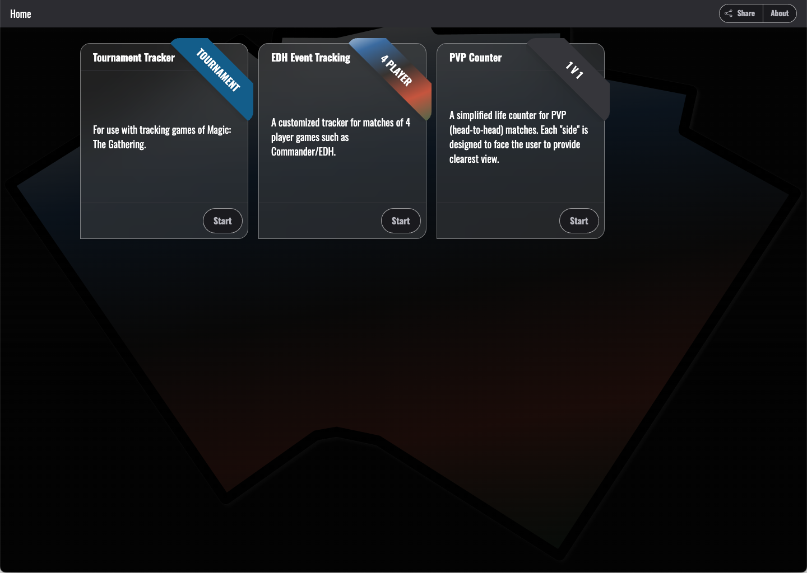
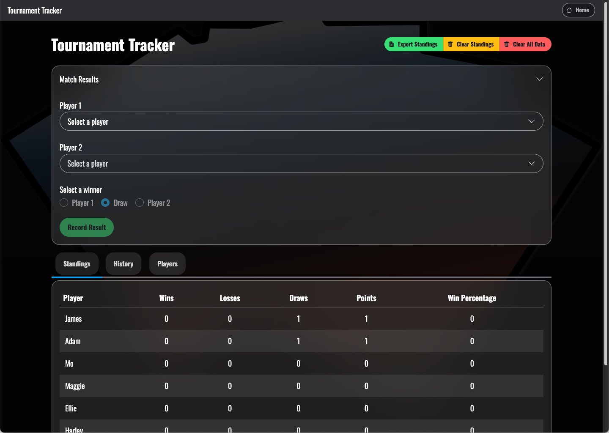
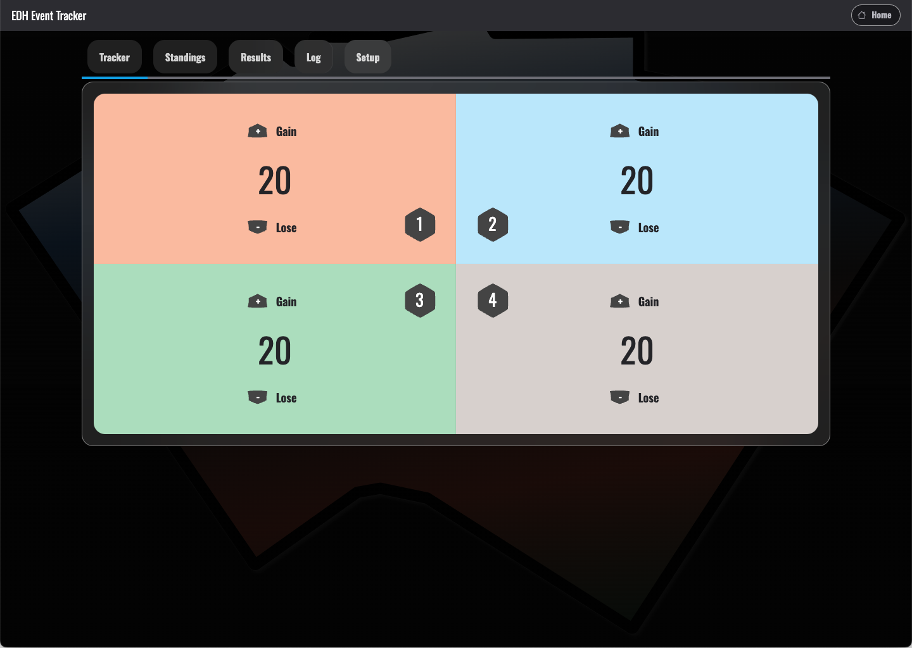
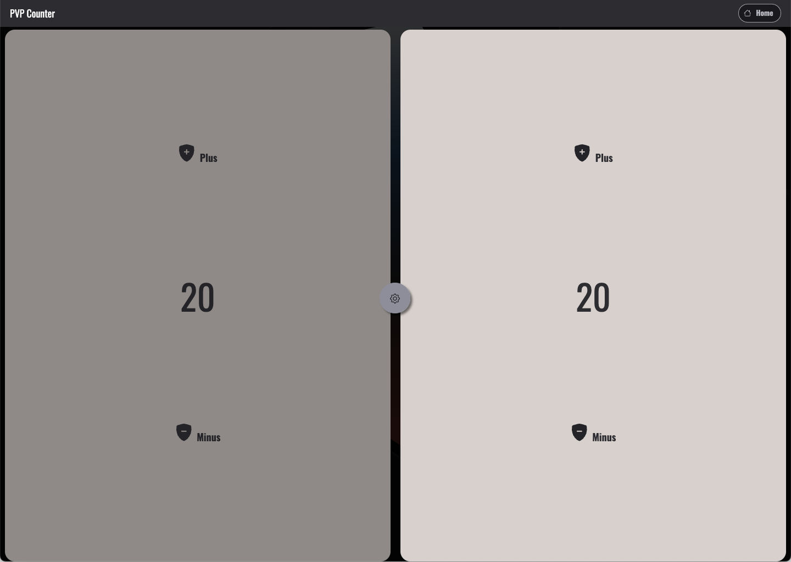
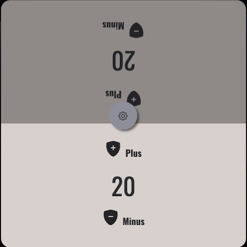
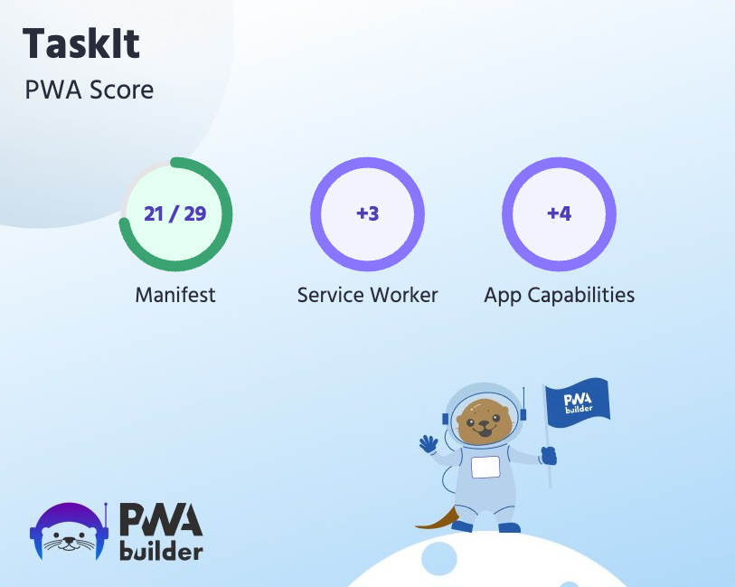

# Game Tracker

## What is this?

Game Tracker, or "Moonsilver Waypoints" as it is known on app store, is a PWA (Progressive Web App) that provides users with the ability to keep track of their life totals, match history, and tournament standings. Primarily designed for games of Magic: The Gathering, there are three separate styles of trackers - Tournament, EDH/Commander, and Standard (1v1).

### History

Originally, I wanted to make a task tracking app that kept data in the browser's cache, which I would export daily to a spreadsheet. Ultimately, I was sidetracked while listening to YouTube and went down the road of creating a game tracking interface for when I play MTG: The Gathering. I'm sure I'll get back to the task tracking part eventually.

## How does it work?

Using Service Workers, data is stored locally on the user's device. Users are able to export their tournament standings and match statistics to backup anything that they may wish to have for external use. No data is shared externally or stored outside of the app unless the user export their information - all that is recorded regarding user activity is page hits.

### Screenshots

> as of March 12, 2025

## How do I get it?

Game Tracker is available as a PWA (Progressive Web App), installable on desktop and mobile devices. It is currently in testing for release on the iOS app store, under the name "Moonsilver Waypoints".

---

## Resources and Credits

This app was built using [Vite](https://vitejs.dev/) with Typescript. To make it a PWA, I utilized [PWA Builder](https://www.pwabuilder.com) along with the [Vite PWA plugin](https://vite-pwa-org.netlify.app).

PWA Builder was used to create a package for the AppStore, which I configured in Xcode and is currently in testing through Apple's TestFlight service.

### Links

- [Mana Icons](https://mana.andrewgioia.com/icons.html) by [Andrew Gioia](https://andrewgioia.com)
- [Keyrune Icons](https://keyrune.andrewgioia.com) by [Andrew Gioia](https://andrewgioia.com)
- [PWA Builder](https://www.pwabuilder.com)
  - [PWA_STARTER](PWA_STARTER.md)

### Disclaimer

> **Disclaimer** Magic: The Gathering is © [Wizards of the Coast](https://company.wizards.com/en). This project is not affiliated nor produced nor endorsed by Wizards of the Coast.
All card images, mana symbols, expansions and art related to Magic the Gathering is a property of Wizards of the Coast/Hasbro.
This project may use the trademarks and other intellectual property of Wizards of the Coast LLC as permitted under Wizards' Fan Site Policy. MAGIC: THE GATHERING® is a trademark of Wizards of the Coast. For more information about Wizards of the Coast or any of Wizards' trademarks or other intellectual property, please visit their website at [https://company.wizards.com/](https://company.wizards.com/).

---

## PWA Builder Report Card

> As of February 27, 2025

